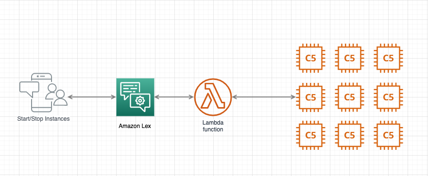

# EC2 Start/Stop Bot - Setup and Installation Guide

This guide will walk you through setting up the Amazon Lex bot that allows you to start and stop EC2 instances using conversational commands.

## Table of Contents
- [Prerequisites](#prerequisites)
- [Architecture Overview](#architecture-overview)
- [Step 1: Tag Your EC2 Instances](#step-1-tag-your-ec2-instances)
- [Step 2: Create IAM Role for Lambda](#step-2-create-iam-role-for-lambda)
- [Step 3: Deploy Lambda Function](#step-3-deploy-lambda-function)
- [Step 4: Create Amazon Lex Bot](#step-4-create-amazon-lex-bot)
- [Step 5: Test Your Bot](#step-5-test-your-bot)
- [Troubleshooting](#troubleshooting)

## Prerequisites

Before you begin, ensure you have:

- **AWS Account** with appropriate permissions to:
  - Create and manage Lambda functions
  - Create and manage Amazon Lex bots
  - Manage EC2 instances
  - Create IAM roles and policies
- **AWS CLI** installed and configured (optional, but recommended)
- **Python 3.x** installed locally (for testing)
- **boto3** library (AWS SDK for Python)

## Architecture Overview

The solution consists of:
1. **Amazon Lex Bot** - Handles natural language conversation
2. **AWS Lambda Function** - Executes the start/stop commands
3. **EC2 Instances** - Tagged instances that will be controlled
4. **IAM Role** - Grants Lambda permission to manage EC2 instances



## Step 1: Tag Your EC2 Instances

The Lambda function identifies EC2 instances by their tags. You need to add a `Type` tag to your instances.

### Using AWS Console:
1. Navigate to **EC2 Console**
2. Select your instance(s)
3. Click **Tags** tab
4. Add a new tag:
   - **Key**: `Type`
   - **Value**: Choose a meaningful name (e.g., `License`, `Render`, `Workstation`)

### Using AWS CLI:
```bash
aws ec2 create-tags \
  --resources i-1234567890abcdef0 \
  --tags Key=Type,Value=License
```

**Example tag values:**
- `License` - License servers
- `Render` - Render farm instances
- `Workstation` - Development workstations

## Step 2: Create IAM Role for Lambda

The Lambda function needs permissions to describe, start, and stop EC2 instances.

### Using AWS Console:

1. Navigate to **IAM Console** → **Roles** → **Create role**
2. Select **AWS service** → **Lambda**
3. Click **Next: Permissions**
4. Create a new policy with the following JSON:

```json
{
  "Version": "2012-10-17",
  "Statement": [
    {
      "Effect": "Allow",
      "Action": [
        "ec2:DescribeInstances",
        "ec2:StartInstances",
        "ec2:StopInstances",
        "logs:CreateLogGroup",
        "logs:CreateLogStream",
        "logs:PutLogEvents"
      ],
      "Resource": "*"
    }
  ]
}
```

5. Name the policy: `LexEC2StartStopPolicy`
6. Name the role: `LexEC2StartStopLambdaRole`
7. Complete the role creation

### Using AWS CLI:

```bash
# Create the policy
aws iam create-policy \
  --policy-name LexEC2StartStopPolicy \
  --policy-document file://policy.json

# Create the role
aws iam create-role \
  --role-name LexEC2StartStopLambdaRole \
  --assume-role-policy-document '{
    "Version": "2012-10-17",
    "Statement": [{
      "Effect": "Allow",
      "Principal": {"Service": "lambda.amazonaws.com"},
      "Action": "sts:AssumeRole"
    }]
  }'

# Attach the policy to the role
aws iam attach-role-policy \
  --role-name LexEC2StartStopLambdaRole \
  --policy-arn arn:aws:iam::YOUR_ACCOUNT_ID:policy/LexEC2StartStopPolicy
```

## Step 3: Deploy Lambda Function

### Using AWS Console:

1. Navigate to **Lambda Console** → **Create function**
2. Choose **Author from scratch**
3. Configure:
   - **Function name**: `LexEC2StartStop`
   - **Runtime**: Python 3.9 (or later)
   - **Role**: Use the role created in Step 2
4. Click **Create function**
5. In the **Code** tab, copy the contents of `lambda.py` from this repository
6. Configure **Environment variables**:
   - Key: `INSTANCE_REGION`
   - Value: Your AWS region (e.g., `us-east-1`)
7. Set **Timeout** to 30 seconds (Configuration → General configuration)
8. Click **Deploy**

### Using AWS CLI:

```bash
# Package the Lambda function
zip lambda.zip lambda.py

# Create the Lambda function
aws lambda create-function \
  --function-name LexEC2StartStop \
  --runtime python3.9 \
  --role arn:aws:iam::YOUR_ACCOUNT_ID:role/LexEC2StartStopLambdaRole \
  --handler lambda.lambda_handler \
  --zip-file fileb://lambda.zip \
  --timeout 30 \
  --environment Variables="{INSTANCE_REGION=us-east-1}"
```

### Test the Lambda Function:

You can test the Lambda function using the test JSON files in the `lambda/` directory:

```bash
aws lambda invoke \
  --function-name LexEC2StartStop \
  --payload file://lambda/lambda.startinstances.license.json \
  response.json
```

## Step 4: Create Amazon Lex Bot

### Using AWS Console:

1. Navigate to **Amazon Lex Console** → **Bots** → **Create bot**
2. Choose **Create a blank bot**
3. Configure bot:
   - **Bot name**: `StartStopServerBot`
   - **IAM permissions**: Create a role with basic Lex permissions
   - **COPPA**: No
   - **Session timeout**: 5 minutes

#### Create StartInstances Intent:

1. Click **Add intent** → **Add empty intent**
2. Name: `StartInstances`
3. Add **Sample utterances**:
   ```
   Start {serverType} instances
   Start {serverType} servers
   Start the {serverType} servers
   Turn on {serverType} instances
   Power on {serverType}
   ```
4. Add **Slot**:
   - **Name**: `serverType`
   - **Slot type**: Create custom type `ServerType`
   - **Values**: `License`, `Render`, `Workstation`
   - **Prompt**: "Which server type would you like to start?"
5. In **Fulfillment**, select **Lambda function**: `LexEC2StartStop`

#### Create StopInstances Intent:

1. Click **Add intent** → **Add empty intent**
2. Name: `StopInstances`
3. Add **Sample utterances**:
   ```
   Stop {serverType} instances
   Stop {serverType} servers
   Stop the {serverType} servers
   Turn off {serverType} instances
   Power off {serverType}
   Shutdown {serverType}
   ```
4. Add **Slot**:
   - **Name**: `serverType`
   - **Slot type**: Use existing `ServerType`
   - **Prompt**: "Which server type would you like to stop?"
5. In **Fulfillment**, select **Lambda function**: `LexEC2StartStop`

#### Build and Test:

1. Click **Build** at the top of the page
2. Wait for the build to complete
3. Use the **Test** panel to try commands like:
   - "Start license servers"
   - "Stop render instances"

### Grant Lex Permission to Invoke Lambda:

```bash
aws lambda add-permission \
  --function-name LexEC2StartStop \
  --statement-id lex-permission \
  --action lambda:InvokeFunction \
  --principal lex.amazonaws.com \
  --source-arn "arn:aws:lex:REGION:ACCOUNT_ID:bot:StartStopServerBot:*"
```

## Step 5: Test Your Bot

### Using Lex Console:

1. In the Lex Console, click the **Test** button
2. Try these commands:
   - "Start license instances"
   - "Stop render servers"
   - "Turn on workstation"

### Expected Responses:

- Success: "EC2 instances with tag License were STARTED successfully!"
- Error: "A problem was encountered trying to START the License EC2 instances"

### Integration Options:

Once tested, you can integrate your bot with:
- **Amazon Connect** - Voice-based interaction
- **Facebook Messenger** - Chat interface
- **Slack** - Slack bot integration
- **Twilio SMS** - SMS commands
- **Custom applications** - Using AWS SDK

## Troubleshooting

### Lambda Function Issues:

**Error: "No instances found"**
- Verify your EC2 instances have the `Type` tag
- Check the tag value matches what you're saying to the bot
- Verify the `INSTANCE_REGION` environment variable is correct

**Error: "Access Denied"**
- Ensure the Lambda IAM role has the correct permissions
- Verify the Lambda function has permission to invoke Lex

### Lex Bot Issues:

**Bot doesn't understand commands:**
- Add more sample utterances to the intents
- Check that slot types are configured correctly
- Rebuild the bot after making changes

**Lambda not being called:**
- Verify Lambda permissions for Lex
- Check CloudWatch Logs for Lambda execution errors
- Ensure the correct Lambda function is selected in the intent fulfillment

### Viewing Logs:

Lambda logs are in **CloudWatch Logs**:
```bash
aws logs tail /aws/lambda/LexEC2StartStop --follow
```

## Security Considerations

1. **Least Privilege**: Consider restricting EC2 permissions to specific instances using tags
2. **Authentication**: Integrate with Amazon Cognito for user authentication
3. **Audit Trail**: Enable CloudTrail to log all EC2 start/stop actions
4. **Cost Control**: Set up billing alerts for EC2 usage

## Cost Estimation

- **Amazon Lex**: $0.00075 per voice request, $0.004 per text request (first 10,000 requests/month free)
- **AWS Lambda**: First 1M requests free, then $0.20 per 1M requests
- **EC2**: Standard EC2 instance pricing applies

## Next Steps

- Add confirmation dialogs before stopping instances
- Implement instance status checking
- Add support for listing available instances
- Create scheduled start/stop using EventBridge
- Add notification integration (SNS/Email)

## Support

For issues or questions:
- Check the [AWS Lex Documentation](https://docs.aws.amazon.com/lex/)
- Review [AWS Lambda Documentation](https://docs.aws.amazon.com/lambda/)
- Open an issue in this repository

## License

This project is provided as-is for demonstration purposes.
